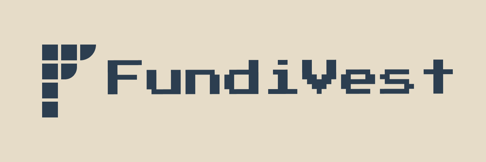
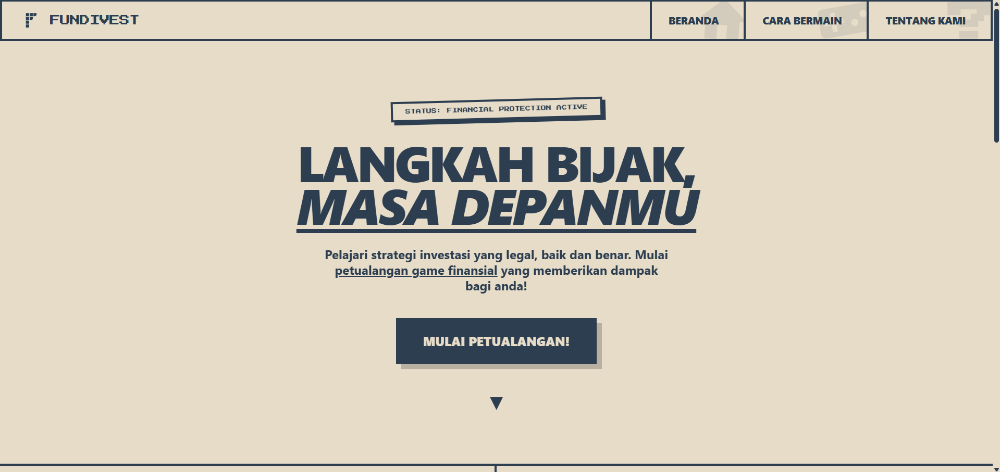
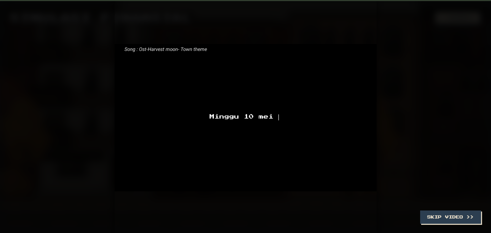

<div align="center">
  

  <h1>FundiVest</h1>
  <p><b>Karena pengalaman adalah tameng terbaik melawan penipuan.</b></p>
</div>

---

## Tentang Project

Masih banyak yang gampang tergiur investasi bodong — mulai dari skema Ponzi, robot *trading* abal-abal, sampai janji profit yang nggak masuk akal. Kenapa? Karena tahu teorinya saja tidak cukup kalau belum pernah berhadapan langsung dengan trik manipulatif para penipu.

Di situlah **FundiVest** hadir. Kami mengubah edukasi finansial menjadi simulasi interaktif berbasis cerita dengan balutan *pixel art*. Latih instingmu untuk membaca *red flags*, tentukan pilihanmu, dan hadapi konsekuensinya — tanpa perlu takut kehilangan uang sepeser pun.

---

## Fitur Utama

**Simulasi Berbasis Cerita (Pilihan & Konsekuensi)**
Kamu adalah sutradara finansialmu sendiri. Setiap keputusan akan membawamu ke alur cerita yang berbeda.

**Multiple Endings**
Hadapi godaan investasi fiktif dan lihat apakah kamu akan mendapatkan *Happy Ending*, terjebak di *Bad Ending*, atau memicu *Secret Ending*.

**Deteksi Red Flags**
Belajar mengenali ciri-ciri penipuan investasi (skema Ponzi, *fake trading*, dll) lewat pengalaman langsung, bukan sekadar teori.

**Pixel Art UI/UX**
Pengalaman visual retro yang unik, interaktif, dan anti-membosankan.

---

## Tech Stack

| Layer | Teknologi |
|-------|-----------|
| Frontend | Vue.js, TypeScript, Tailwind CSS |
| Backend | Go (Fiber Framework) |
| Database | PostgreSQL |

---

## Struktur Project

Karena project ini memiliki arsitektur yang cukup besar, kami memisahkan *repository* Frontend dan Backend. Berikut adalah struktur utama untuk masing-masing bagian:

### 1. Frontend (fundivest-frontend)
Dibangun menggunakan Vue 3, Vite, dan TypeScript dengan pengorganisasian folder yang rapi:

~~~text
fundivest-frontend/
|-- public/                 # Asset statis yang tidak di-compile
|-- src/
|   |-- api/                # Konfigurasi dan endpoint API services
|   |-- assets/             # Gambar pixel art, icon, dan stylesheet global
|   |-- components/         # Reusable Vue components
|   |-- composables/        # Vue 3 Composition API (Reusables logic)
|   |-- config/             # Konfigurasi aplikasi
|   |-- constants/          # Variabel konstan yang sering digunakan
|   |-- data/               # Static data (mockup atau alur cerita default)
|   |-- interfaces/         # TypeScript Interfaces / Types definitions
|   |-- layouts/            # Template layout halaman (misal: Main, Dashboard)
|   |-- pages/              # Halaman utama aplikasi (Views)
|   |-- partials/           # Potongan komponen kecil spesifik
|   |-- router/             # Konfigurasi Vue Router
|   |-- services/           # Business logic spesifik / eksternal integrasi
|   |-- store/              # State Management (Pinia/Vuex)
|   |-- utils/              # Helper functions
|   |-- App.vue             # Root component
|   `-- main.ts             # Entry point aplikasi frontend
|-- .env                    # Environment variables default
|-- index.html              # Entry point HTML
|-- package.json            # Daftar dependencies
`-- vite.config.ts          # Konfigurasi Vite
~~~

### 2. Backend (fundivest-backend)
Dibangun menggunakan Go dengan *Clean Architecture* dan *Dockerized* siap untuk *deployment*:

~~~text
fundivest-backend/
|-- cmd/
|   |-- api/                # Main entry untuk REST API Server
|   `-- worker/             # Main entry untuk Background Worker
|-- internal/
|   |-- config/             # Konfigurasi aplikasi & database
|   |-- domain/             # Core business logic / Entities
|   |-- handler/            # HTTP Controllers / Routing logic
|   |-- pkg/                # Utility packages (QRCode, Validator)
|   |-- pubsub/             # Implementasi Pub/Sub (Valkey/Redis)
|   |-- queue/              # Asynchronous Task Queue (Asynq)
|   |-- repository/         # Integrasi Database (PostgreSQL, Valkey)
|   |-- service/            # Usecases / Application Services
|   |-- storage/            # Object Storage (Minio / S3)
|   `-- worker/             # Background Task Processors (PDF Generator, dll)
|-- migrations/             # File migrasi skema database
|-- templates/              # HTML Templates (misal: Certificate)
|-- tests/                  # Integration tests
|-- Dockerfile.api          # Docker build untuk API
|-- Dockerfile.worker       # Docker build untuk Worker
`-- docker-compose.yml      # Konfigurasi local orchestration (DB, Minio, Valkey, dll)
~~~

---

## Prasyarat

Pastikan *tools* berikut sudah ter-install di sistemmu:

- [Node.js](https://nodejs.org/) v18+
- [Go](https://go.dev/) v1.20+
- [PostgreSQL](https://www.postgresql.org/)

---

## Instalasi & Menjalankan Project

### 1. Clone Repository

```bash
git clone https://github.com/[USERNAME_KAMU]/fundivest.git
cd fundivest
```

### 2. Setup Database (PostgreSQL)

Buat database baru bernama `fundivest_db` (atau sesuaikan dengan preferensimu), lalu siapkan *username* dan *password* untuk dimasukkan ke file `.env`.

### 3. Setup Backend (Go Fiber)

```bash
cd backend

# Salin file environment dan sesuaikan kredensial PostgreSQL
cp .env.example .env

# Install dependencies
go mod tidy

# Jalankan server backend
go run main.go
```

### 4. Setup Frontend (Vue.js)

```bash
cd frontend

# Salin file environment jika diperlukan
cp .env.example .env

# Install dependencies
npm install

# Jalankan dev server
npm run dev
```

---

## Screenshot / Demo

| Halaman Utama | Simulasi & Pilihan |
|:---:|:---:|
|  |  |

---

## Tim Kami

| Nama | Peran |  
|------|-------|
| Alfa | Front-End Developer 
| Ega | Back-End Developer | 
| Saladin | Content Writer | 
| Rangga | Presenter |  

